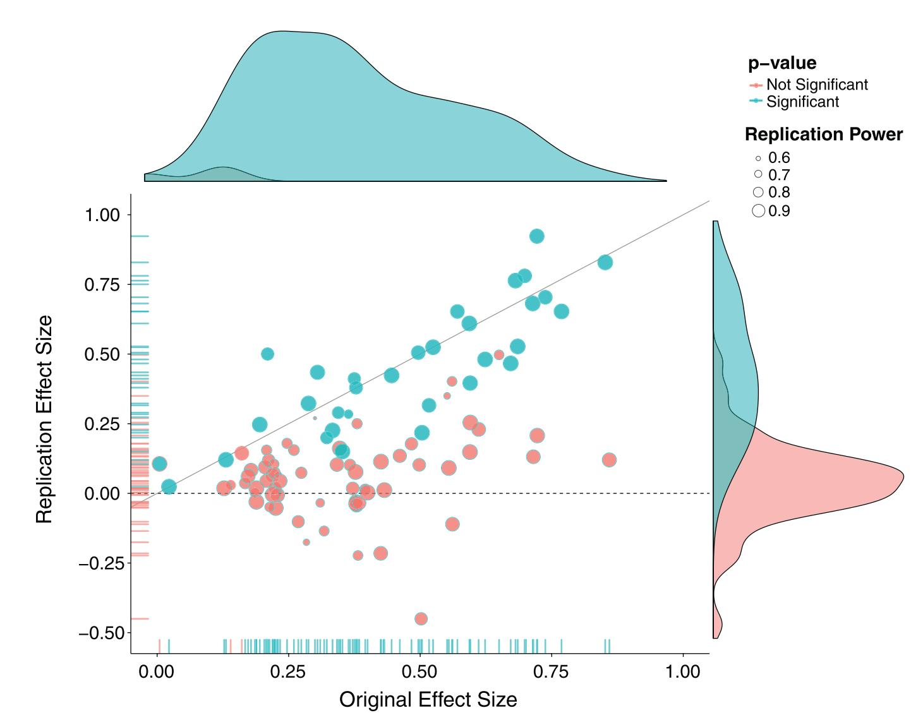

<!-- Spanner Image -->


Eines der Anwendungsgebiete von R ist die Visualisierung statistischer Daten. Durch die Fülle der vorhandenen Pakete, können eine Vielzahl von Abbildungen erstellt werden, die andere Statistikprogramme im wahrsten Sinne des Wortes alt aussehen lassen. Der *de facto* Standard zur Erstellung wissenschaftlicher Abbildung ist das Paket `ggplot2`, das mit dem [Tidyverse](pakete.html) installiert und standardmäßig geladen wird.


```{r message=FALSE}
library(tidyverse)
```

# Grammar of Graphics

# Statistische Zusammenfassungen

# Fallstudie
Eine tolle Abbildung, an der viel lernen können, stammt von der @OpenScienceCollaboration.2015[, S. 6] und wurde im Magazin *Science* veröffentlicht. Die Gruppe hatte sich zum Ziel gesetzt, hundert psychologische Studien zu replizieren. Sie wählten hoch publizierte Studien aus und versuchten diese unabhängig von der originalen Arbeitsgruppe zu replizieren. Das Ergebnis war sehr ernüchternd, weil ca. 65% der Studien *nicht* repliziert werden konnten und die durchschnittliche Effektstärke der replizierten Studien nur halb so groß war, wie in den Original-Studien. Die Psychologie wurde spätestens damit in eine fortwährende Replikations-Krise gestürzt.

Einen Teil ihrer Ergebnisse fasste die Gruppe in einer sehr informationsreichen Abbildung zusammen (Abbildung 3 in der Originalarbeit).

```{r out.width="80%", fig.align="center", echo=FALSE}

```

Hier können wir auf der $x$-Achse die Effektstärke der Original-Arbeit sehen (in $r$) und auf der $y$-Achse die Effektstärke der Replikations-Studie. Zudem wurde farblich kenntlich gemacht, ob eine Studie in der Replikation signifikant, also ob $p < 0.05$ war. Dann wurde die Größe der einzelnen Datenpunkte skaliert anhand der Power der Replikationsstudie, wir haben Fransenachsen, die uns die Verteilung der Studien anzeigen und dann sind noch zusätzlich Kerndichteschätzungen der Verteilulng der Effektstärken für die Original- und Replikationsstudien am Rand der Abbildung angegeben.

Auch wenn diese Abbildung sehr kompliziert zu erstellen scheint, und es mit herkömmlichen Programmen unmöglich wäre, eine solche Abbildung in einem Schritt und reproduzierbar zu erstellen, können wir diese Abbildung mit `ggplot2` im Handumdrehen auf unseren Bildschirm zaubern. Die Grundlage einer jeden Abbildung sind natürlich Daten. Die Original-Daten der Autoren kann man sich beim [Open Science Framework](https://osf.io/ezcuj) herunterladen und sich am *data cleaning* versuchen. Eine abgespeckte Version der Daten, die alle nötigen Variablen enthält, findet sich aber auch im [`costatcompanion`](pakete.html#costatcompanion) als `reproducibility_project`.

```{r}
library(costatcompanion)

reproducibility_project
```


## Basis-Plot
Beginnen wir mit dem Basis-Plot in der Mitte. Da für einige Studien keine Effektstärken berechnet werden konnten, filtern wir uns nur die Fälle raus, bei denen wir eine Effektstärke für beide Messungen haben.

```{r}
reproducibility_complete <- reproducibility_project %>% 
  filter(!is.na(es_original) & !is.na(es_replication))

reproducibility_complete
```

Wie immer fangen wir an, unsere $x$- und $y$-Achse zu definieren. Dann wollen wir Punkte zeichnen, also können wir gleich ein `geom_point()` hintererschmeißen. Die Effektstärke der Original-Studie findet sich im Datensatz unter der Variablen `es_original`, die der Replikation unter `es_replication`. 

```{r}
reproducibility_complete %>% 
  ggplot(aes(x = es_original, y = es_replication)) +
  geom_point()
```

Nun wollen wir etwas Farbe ins Spiel bringen, also angeben, ob eine Studie in der Repliktaion signifikant war, oder eben nicht. Die Variable, die uns das angibt, ist `sig_replication`.

```{r}
reproducibility_complete %>% 
  ggplot(aes(x = es_original, y = es_replication, color = sig_replication)) +
  geom_point()
```

Wunderbar, als nächstes wollen wir die Größe der Punkte abhängig von der Power in der Replikations-Studie machen. Die entsprechende Variable heißt `power_r`.

```{r warning=FALSE}
reproducibility_complete %>% 
  ggplot(aes(x = es_original, y = es_replication, color = sig_replication, size = power_r)) +
  geom_point()
```

Das ist schon gar nicht schlecht, aber wir haben jetzt das Problem von "overplotting", also, dass viele Datenpukte übereinander liegen könnten, ohne, dass wir das mitbekommen. Eine gute Lösung ist es, die einzelnen Punkte transparent zu machen. Wir wollen, dass das ausschließlich die Punkte betrifft, weshalb wir diese Transformation auch nur in der Ebene der Punkte angeben können. Transparenz steuert man über das Argument `alpha`.

```{r warning=FALSE}
reproducibility_complete %>% 
  ggplot(aes(x = es_original, y = es_replication, color = sig_replication, size = power_r)) +
  geom_point(alpha = 0.4)
```

Das sieht schon ziemlich professionell aus, und tatsächlich gibt es einige Cluster von Punkten, die ziemlich genau übereinander liegen. Um das auch etwas klarer zu machen, wurden "Fransen"-Achsen eingezeichnet, die die Verteilung der Datenpunkte noch einmal genauer darstellen. Diese können wir mit `geom_rug()` erstellen.

```{r warning=FALSE}
reproducibility_complete %>% 
  ggplot(aes(x = es_original, y = es_replication, color = sig_replication, size = power_r)) +
  geom_point(alpha = 0.4) +
  geom_rug()
```

Wir stellen jedoch fest, dass die Größe der Fransen nicht stimmt und die Farbe der Fransen auf der $x$-Achse nicht stimmt. Das Problem der Größe erhalten wir dadurch, dass wir die Größe als "allgemeine" *aesthetic* zugeornet haben. Wir wollen jedoch nur, dass die Punkte von der Größe beeinflusst werden, weshalb wir diese *aesthetic* nun nur in der Ebene der Punkte mappen.

```{r warning=FALSE}
reproducibility_complete %>% 
  ggplot(aes(x = es_original, y = es_replication, color = sig_replication)) +
  geom_point(aes(size = power_r), alpha = 0.4) +
  geom_rug()
```

Das sieht schon besser aus. Aus der Vorlage geht hervor, dass die Einfärbung der Fransen auf der $x$-Achse nicht anhand der Signifikanz in der Replikation erfolgen soll (also nicht anhand `sig_replication`), sondern in Bezug auf die Signifikanz in der Original-Studie (also `sig_original`). Auch das können wir ganz einfach umsetzen, indem wir jeweils ein `geom_rug()` für die beiden Achsen mit unterschiedlichen *aesthetics* einzeichnen.

```{r}
reproducibility_complete %>% 
  ggplot(aes(x = es_original, y = es_replication, color = sig_replication)) +
  geom_point(aes(size = power_r), alpha = 0.4) +
  geom_rug(aes(color = sig_original), sides = "b") +
  geom_rug(aes(color = sig_replication), sides = "l")
```


In unserer Vorlage aus der Original-Arbeit haben die Autoren noch zwei Hilfslinien eingezeichnet: Eine horizontale, die durch den $y$-Achsen-Abschnitt 0 geht und eine schräge, die die Steigung 1 hat und $y$ auch bei 0 schneidet. Eine horizontale Linie können wir mit `geom_hline()` zeichnen lassen, eine schräge mit `geom_abline()`.

```{r}

```


# Literatur