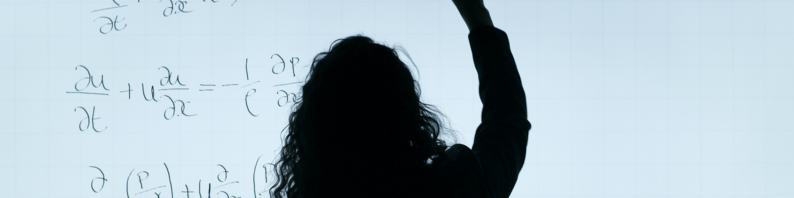

```{r echo=FALSE, message=FALSE}
knitr::opts_chunk$set(fig.align = "center")
ggplot2::theme_set(ggplot2::theme_light())

library(tidyverse)
library(haven)
library(rstatix)
```



Für viele Methoden und Verfahren ist es zwar wichtig zu verstehen, was diese machen und berechnen, aber die Formeln an sich braucht man anscheinend nur in Klausuren. Für den interessierten Leser finden sich hier einige wichtige Formeln zu bereits behandelten Themen.

# Effektstärken
## Gruppenunterschiede
### Cohens $d$
Nach @Cohen.1988[S. 20]^[im Sinne einer einheitlichen, einfachen und bekannten Notation, weiche ich an dieser Stelle von Cohens Notation ab und verwende die gängige Notation, die Studierende mehrheitlich lernen. Für die Übersichtlichkeit wird auf Indizes verzichtet.] $$d = \dfrac{\mu_1-\mu_2}{\sigma}$$ mit $\sigma$ als Standardabweichung der beiden Gruppen.

Nach @Cohen.1988[S. 67] berechnet man $d$ für Gruppen mit ungleichen Standardabweichungen gemäß $$\dfrac{\mu_1 - \mu_2}{s}$$ mit der **gepoolten Standardabweichung** $$s = \sqrt{\dfrac{\sum{(x_1 - \mu_1)^2} + \sum{(x_2 - \mu_2)^2}}{n_1 + n_2 -2}}$$ und $x_1$, sowie $x_2$ als individuelle Werte der Probanden in den Gruppen $1$ und $2$.

### Hedges' $g$
Nach @Hedges.1981[S. 110] $$g = \dfrac{\mu_1 - \mu_2}{s_\text{corrected}}$$ mit der korrigierten Standardabweichung $$s_\text{corrected} = \sqrt{\dfrac{(n_1 - 1) s_1^2 + (n_2 - 1)s_2^2}{n_1 + n_2 -2}}$$

### Hedges' $g^*$
Nach @Hedges.1981[S. 111] erhält man $g^*$ durch die Multiplikation von $g$  mit dem Korrektur-Faktor $$J = \dfrac{\Gamma \left(\frac{\alpha}{2}\right)}{\sqrt{\frac{\alpha}{2}} \cdot \Gamma \left(\frac{\alpha - 1}{2}\right)}$$ und $$\alpha = n_1 + n_2 - 2$$ Der Korrektur-Faktor wird, weil nicht jeder so leicht die Gamma-Funktion ($\Gamma$) berechnen kann, gerne approximativ angegeben als [@Borenstein.2009 S. 27] $$ J \approx 1 - \dfrac{3}{4(n_1 + n_2 - 2) - 1} $$

### Glass' $\Delta$
$$\Delta = \dfrac{\mu_1 - \mu_2}{\sigma_\text{Kontrollgruppe}}$$

## Zusammenhänge
### Perasons $r$
$$r = \dfrac{1}{n-1}\sum_{i = 1}^n{\left(\frac{x_i - \bar{x}}{s_x}\right)\left(\frac{y_i - \bar{y}}{s_y}\right)}$$ mit $n$ als Anzahl Stichprobengröße, $x_i$ und $y_i$ als individuelle Werte der Probanden auf den Variablen $x$ und $y$, sowie $\bar{x}$ und $\bar{y}$ als Mittelwerte der beiden Variablen, sowie $s_x$ und $s_y$ als Standardabweichung der Variablen.

# Literatur